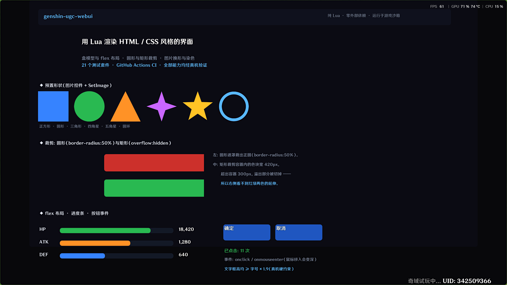
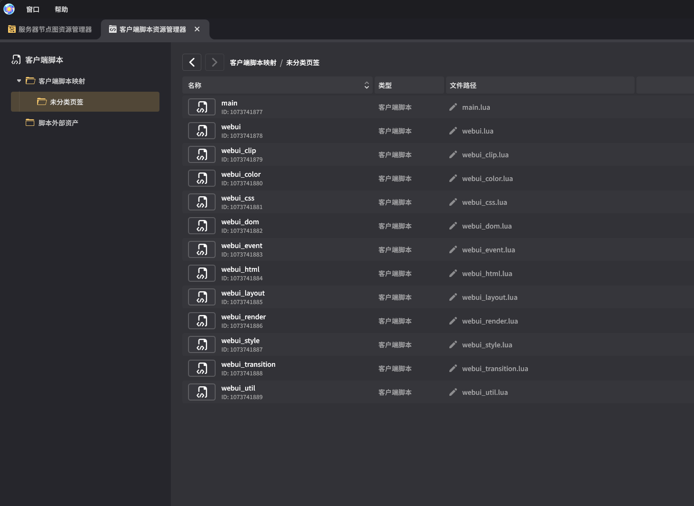

# genshin-ugc-webui

**用 Lua 在原神「千星奇域」（UGC）里渲染 HTML / CSS 风格的界面。**

一个纯 Lua 实现的轻量 WebUI 引擎 —— 把 HTML/CSS 解析、布局、渲染到游戏的客户端控件上。
零外部依赖，可在游戏沙箱内运行。



<div align="center">

*① 真机运行效果 —— 形状 / 裁剪 / flex / 事件，一屏内展示全部已验证能力*
</div>

---

## 这是什么

原神 UGC 的客户端控件 API 只提供基础控件（文本框、容器、按钮、图片）。
本项目在其上实现一套 **HTML/CSS 子集**，让你用熟悉的写法做界面：

```html
<div class="card">
  <div class="avatar"></div>
  <div class="name">若娜瓦</div>
  <div class="bar"><div class="fill"></div></div>
</div>
```
```css
.card   { width: 260px; height: 168px; overflow: hidden; }
.avatar { width: 130px; height: 130px; border-radius: 50%; }
.bar    { width: 440px; height: 16px; background-color: #2a3050; }
.fill   { width: 300px; height: 16px; background-color: #4ad07a; }
```

支持的 `overflow:hidden` 矩形裁剪、`border-radius` 圆形裁剪、
`flex` 布局、`transform`、`transition`、`:hover` 伪类、`z-index` 等。

---

## 能力概览

| 类别 | 支持 |
|---|---|
| **布局** | 盒模型、`flex`（含 `wrap` / `grow` / `shrink` / `column` 对齐）、绝对定位、百分比 / `px` / `em` |
| **样式** | CSS 选择器、层叠、继承、特指度、`:hover` / `:active` |
| **视觉** | 纯色块、文字、**圆形裁剪**、**矩形裁剪**、**任意形状裁剪**、`transform`、`transition`、`z-index` |
| **交互** | `onclick` / `onmouseenter` / `ondrag` 等 8 种光标事件 |
| **图片** | 运行时 `SetImage` 换图、`imageColor` 染色 |

### 引擎做不到的

自定义字体、粗体/斜体、富文本、圆角/边框/阴影（只能预配图片）。

详见 [`docs/引擎能力与限制.md`](docs/引擎能力与限制.md)（权威版）。

---

## 快速开始

### 写一个页面

只需给 HTML / CSS，以及当 JS 用的 Lua 事件处理。剩下的
（找根控件、渲染、绑事件、逐帧循环、等 Root 重试）都由库接管：

```lua
local webui = require('webui')

-- ★ 注意写法：必须先 local 声明，再赋值。
--   `local app = webui.mount{...}` 会让 on 表里的闭包看不到 app（恒为 nil），
--   因为 Lua 的 local 在整条赋值语句执行完之前对内部闭包不可见。
--
--   ★ onReady 里也一样看不到（它比 mount 返回更早触发），
--     要用它的第二个参数：onReady = function(ui, app) ... end
local app
app = webui.mount{
  root    = "Root",
  prefabs = { container=1073741933, textbox=1073741934,
              button=1073741935,    image=1073741938 },
  html = [[<div class="card" id="c" onclick="tap">你好</div>]],
  css  = [[
    .card { width:260px; height:60px; background-color:#222; font-size:16px; }
    .card:hover { background-color:#333; }
  ]],
  on = {
    tap = function() app:setText("c", "被点了") end,
  },
}

-- 引擎按固定名字找这几个函数，必须转接一次（3 行）
function OnStart()    app:start()  end
function OnUpdate(dt) app:update() end
function OnDestroy()  app:stop()   end
```

完整可跑示例见 [`deploy/demo_min.lua`](deploy/demo_min.lua)（82 行，
其中大半是 HTML/CSS）。**不写 mount 也可以** —— 用 `webui.new` 手动
控制每一步，见 [`deploy/demo_feature.lua`](deploy/demo_feature.lua)。

<details>
<summary>mount 到底替你做了什么</summary>

| 原来要手写 | 现在 |
|---|---|
| `game.FindClientUIRoot("Root")` | `root = "Root"` |
| `webui.new{...}` + `ui:render()` | `html` / `css` 两个字段 |
| `handlers` 表 | `on` 表 |
| 写 `startLoop`（递归 `TweenSequence`） | `loop`（默认开） |
| `OnStart` 里找 Root + `OnUpdate` 里重试 120 帧 | `app:start()` / `app:update()` |
| `OnDestroy` 里 `Kill` 循环 | `app:stop()` |
| 手写 `refreshCounter` 改文字 | `app:setText(id, text)` |

`app:setText` / `app:setStyle` 内部走 **DOM**（`node:setText`）而不是
直接写控件 —— 渲染器每帧都会用 DOM 文本覆盖控件，直接改 `control.text`
会在下一帧被打回原值（真机踩过：日志在涨、界面恒为 0）。
</details>


### 部署到游戏

**部署就是复制** —— 把`lib/webui/` 里的文件全部复制到你的项目文件夹下，并在`「千星沙箱」`里进行批量导入（见图 ②）

`main.lua` 是你要改的页面默认包含了一份默认的初始界面可供参考，还有一份 `README-webui.md` 使用说明。

<div align="center">



*② 「千星沙箱」客户端脚本导入*
</div>


### 功能展示

`deploy/demo_feature.lua` 是一屏之内展示全部已验证能力的示例页，
也用于拍摄 README 顶部的那张截图：

| 区块 | 展示的能力 |
|---|---|
| 顶栏 / 标题 | 盒模型、flex（`justify-content: space-between`）、文字渲染 |
| 圆形头像 | `border-radius: 50%` 圆形裁剪（图片控件 + 圆形遮罩） |
| 形状行 | 六种预置形状：方 / 圆 / 三角 / 四角星 / 五角星 / 圆环（`SetImage` + `imageColor` 染色） |
| 裁剪区 | `overflow:hidden` 矩形裁剪 —— 内部色块宽 420px 超出容器 300px，溢出部分被切掉 |
| 组件区 | flex 行布局、进度条、按钮 `onclick` / `onmouseenter` 事件 |


## 开发


### 测试

```bash
cd <repo>
lua tests/test_html.lua      # 单个
for f in tests/test_*.lua; do lua "$f" || echo "FAIL $f"; done   # 全部
```

**28 个套件全部通过。** 路径自包含，任何目录都能跑。


### 真机验证

`deploy/probe.lua` 是**统一探针**，改一行切换测试模块：

```lua
local ACTIVE = "clip"   -- text / clip / mask / glyph / all
```

| 模块 | 内容 |
|---|---|
| `text` | 文字渲染定位（框高/字号对照） |
| `clip` | 裁剪容器（imageColor 对照） |
| `mask` | 遮罩形状 / 换图 / 矩形裁剪 |
| `glyph` | 几何字符 / 无缝方案 |

探针头部固化了**历史结论**和**硬性约束清单**，写新验证前先读。

---

## 关键约束（真机实测）

写代码前务必知道这几条 —— 都是踩过的坑：

| 约束 | 说明 |
|---|---|
| **文字框高 ≥ 字号 × 1.9** | 框太矮时引擎的**字号自适应会把字压没**，症状是"文字凭空消失"，而日志全对 |
| **裁剪容器不设 `background-color`** | 它的填充不受自身遮罩约束，会溢出到裁剪区外 |
| **容器高度要装得下内容** | 溢出内容**仍可见但失去父背景** → 看起来"某块背景颜色不同" |
| **新控件 `active` 默认 `false`** | 不调 `SetActive(true)` 则完全不可见，但字段写入照常成功 |
| **自定义字段不可写** | 控件上无法存状态；需用外部表或 `GetChildren()` |
| **字段按控件类型封死** | 容器/按钮写 `bgColor`/`text` 静默失败 |
| **`fontSize` 必须整数** | 浮点写入失败 |
| **`OnUpdate` 不驱动** | 逐帧靠递归 `TweenSequence` |
| **枚举名不能照文档猜** | 真名是 `Enum.ImageSource.StaticReference` |

完整的权威清单见 [`docs/引擎能力与限制.md`](docs/引擎能力与限制.md)。

---

## 文档

| 文档 | 内容 |
|---|---|
| [引擎能力与限制.md](docs/引擎能力与限制.md) | ★ 权威版。能力、约束、坐标、方法学、部署机制 |
| [研究总览.md](docs/研究总览.md) | ★ 入口。成果、历程、结论摘要 |
| [client_control_api.md](docs/client_control_api.md) | 官方 API 文档整理（75 表） |
| [GAPS.md](docs/GAPS.md) | 未实现功能 + 优先级 |
| [webui_feasibility.md](docs/webui_feasibility.md) | 早期可行性分析 |
| [真机复用问题复盘.md](docs/真机复用问题复盘.md) | 控件复用 bug 排查 |
| [lib/webui/README.md](lib/webui/README.md) | 库使用文档 |


---

## 目录结构

```
lib/webui/        ★ 库本体（12 个模块）。
                    文件名即部署名（webui_util.lua 等），整目录可直接拷进游戏工程
  ├── webui.lua         对外 API（入口）
  ├── webui_html.lua    HTML 解析
  ├── webui_css.lua     CSS 解析 + 选择器匹配
  ├── webui_style.lua   层叠 / 继承 / 计算样式
  ├── webui_layout.lua  盒模型 + flex
  ├── webui_render.lua  控件池 + diff 渲染
  ├── webui_clip.lua    图片控件（遮罩 / 换图 / 染色）
  └── ...
deploy/           示例与探针
  ├── my_page.lua   ★ 用户视角的完整示例（队伍配置），install 的起始页模板
  ├── probe.lua     统一真机探针（改 ACTIVE 选模块）
  ├── demo_feature.lua  功能展示页（形状 / 裁剪 / flex，用于截图）
  ├── demo_min.lua      最小示例（82 行）
  ├── demo_panel.lua    角色面板
  └── demo_shop.lua     装备商店
docs/             文档（引擎能力、API、Gaps 等）
tests/            28 个测试套件
tools/            构建、验证、mock
  ├── install.py        ★ 一键安装到游戏工程（库 + 起始页 + 说明）
  └── build.lua          可选：打成一个单文件（给"粘贴源码"场景）
```