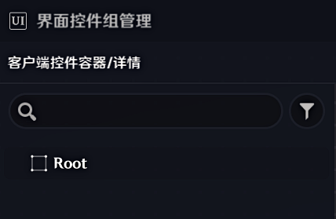
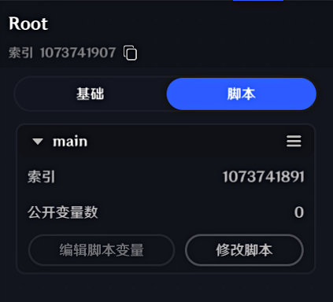
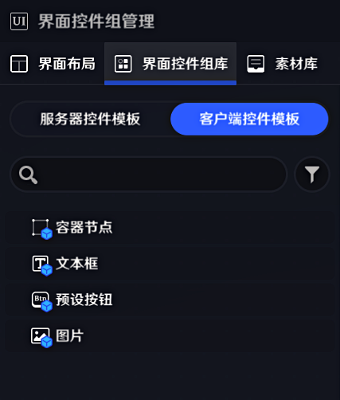
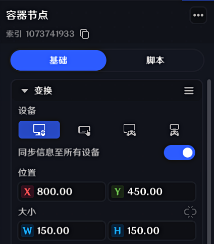

# webui 使用说明

在《原神》千星奇域（UGC）里用 **HTML / CSS** 画界面。纯 Lua 实现，零外部依赖。

---

## 1. 目录里有什么

| 文件 | 说明 |
|---|---|
| `webui.lua` | **库的入口**，不要改 |
| `webui_*.lua` | 库的各个模块（util / dom / css / layout / render …），不要改 |
| `@SAMPLE@` | ★ **你要改的就是这一个文件** |
| `README-webui.md` | 本文件 |

> ⚠️ `webui*.lua` 是库，升级时会被整体覆盖，**不要在里面写业务代码**。

---

## 2. 四步跑起来

### ① 导入到关卡

打开千星编辑器，把本目录里的脚本**导入**到关卡。

> ⚠️ **这一步不能省。** 真机读的是关卡文件 `.gil`，**不是这个文件夹**。
> 只把文件复制进来、不在编辑器里导入，进游戏是什么都不会发生的。

### ② 创建容器节点 `Root`，并把 `@SAMPLE@` 挂在它下面

这是**最容易漏的一步**。库要靠 `game.FindClientUIRoot("Root")` 找挂载点，
所以编辑器里必须有**一个名叫 `Root` 的客户端控件容器**，
并且**把 `@SAMPLE@` 挂到这个节点上**。

**第一步：新建客户端控件容器**

在「界面控件组管理 → 客户端控件容器」里新建一个容器节点：



> ⚠️ 名字**必须是 `Root`**（区分大小写）。
> 想用别的名字也行，但要同步改 `@SAMPLE@` 里的 `root = "Root"`。

**第二步：把脚本挂到该节点上**

选中 `Root` 节点 → 切到「**脚本**」页签 → 挂上脚本：



> ⚠️ **脚本不挂上，进游戏什么都不会发生。**

### ③ 设置容器的位置与缩放

选中 `Root`，在「变换」面板里设成：

| 字段 | 值 |
|---|---|
| 位置 | `X 800` / `Y 450`（1600×900 画布的中心） |
| 大小 | `W 1600` / `H 900` |
| **缩放比例** | **`X 1.01` / `Y 1.01`** ← 关键 |


> ⚠️ **缩放必须是 `1.01`，不能是 `1.00`。**
> 设成 `1.00` 时，控件渲染区域比画布**小一点点**，
> 界面上看起来就是**四周留了一圈缝**（本应铺满的页面没铺满）。
>
> 这是**编辑器里的手工设置**，库改不了（库只能改 `sizeDelta`，
> 改不了 `localScale`）。所以第一次接入时顺手设好。

### ④ 建控件模板，把索引填进 `prefabs`

库不直接画界面 —— 它**实例化编辑器里预先建好的控件模板**。
所以先把四种模板建出来，再读出它们的**索引号**填进去。

**第一步：建四个客户端控件模板**

「界面控件组管理 → **界面控件组库** → **客户端控件模板**」：



| 模板 | 用途 | 必需？ |
|---|---|---|
| **容器节点** | 布局容器（无外观，只组织子控件） | ✅ |
| **文本框** | 所有文字与色块 | ✅ |
| **预设按钮** | 点击 / 悬停等交互层 | ✅ |
| **图片** | 圆形 / 矩形裁剪、形状图 | ⚠️ 裁剪功能必需 |

**第二步：读出每个模板的索引号**

点开模板，标题下方「索引 `1073741xxx`」就是它：



*以「容器节点」为例：索引 `1073741933`（点右侧图标可复制）*

**第三步：填进 `@SAMPLE@` 的 `prefabs`**

```lua
prefabs = {
  container = 1073741933,   -- ← 换成你自己模板的索引
  textbox   = 1073741934,
  button    = 1073741935,
  image     = 1073741938,   -- 圆形/矩形裁剪必需；不填头像出不来
},
```

> 索引只在编辑器里能看到，库无法自己发现。
> **填错不会报错**，只是控件建不出来 —— 界面上什么都没有时，先回来查这里。

### ⑤ 进游戏

应该能看到一张「队伍配置」的卡片界面：点头像能增减队员、有进度条和按钮。

---

## 3. 怎么写自己的界面

`@SAMPLE@` 里除底部 3 行接线外，**全是 HTML / CSS / 事件**：

```lua
local webui = require('webui')

-- ★ app 要先声明，位置见文件里的注释（三个坑都写在里面）
--   其中第三个是 onReady 的：它触发得比 mount 返回更早，
--   所以 onReady 里必须用第二个参数，不能指望外层这个 app。
local app
app = webui.mount{
  root = "Root",
  prefabs = { ... },

  html = [[ <div class="card" onclick="tap">你好</div> ]],
  css  = [[ .card { width:200px; height:60px; background-color:#222; font-size:16px; }
            .card:hover { background-color:#333; } ]],

  on = {
    tap = function(info) app:setText("c", "被点了") end,
  },
}

-- 引擎按固定名字找这三个函数，必须转接（3 行）
function OnStart()    app:start()  end
function OnUpdate(dt) app:update() end
function OnDestroy()  app:stop()   end
```

`mount` 替你做了：找根控件、渲染、绑事件、开逐帧循环、等 Root 就绪时自动重试、
退出时清理。

### 运行时改界面

```lua
app:setText("id", "新文字")                    -- 改文字
app:setStyle("id", "background-color", "#f00")  -- 改样式
app:render(html, css)                           -- 整个换一页
```

> ⚠️ 改文字**必须**用 `app:setText`。直接写 `control.text` 会在下一帧
> 被渲染器用 DOM 里的原文覆盖回去 —— 表现为「点了没反应」，而且不报错。

### 事件

HTML 里写 `onclick="tap"`，`on` 表里就有个 `tap` 函数。回调收到一个表：

```lua
{ event = "CursorClick", node = <DOM节点>, x, y, pressX, pressY, dx, dy, dragging, box = {x,y,w,h} }
```

支持的属性：`onclick` / `onmousedown` / `onmouseup` / `onmouseenter` / `onmouseleave` /
`ondragstart` / `ondrag` / `ondragend`。

---

## 4. 支持的 HTML / CSS

| 类别 | 支持 |
|---|---|
| **布局** | 盒模型、`display: block/inline/inline-block/flex/none`、`flex-wrap`、`flex-grow/shrink/basis`、`justify-content`、`align-items`、`gap`、`position: absolute/relative/fixed`、`px` / `%` / `em` |
| **样式** | 标签 / `.class` / `#id` / 后代 / 子代选择器、**`:hover` / `:active`**、特指度、层叠、继承、内联 `style="..."` |
| **视觉** | `background-color`、`color`、`font-size`、`opacity`、`text-align`、`transform: translate/scale/rotate`、`transition`、`z-index`、**`overflow: hidden`**（矩形裁剪）、**`border-radius: 50%`**（圆形裁剪） |
| **交互** | 上面列的 8 种光标事件 |

**不支持**：自定义字体、粗体/斜体、圆角（非 50%）、边框、阴影、富文本、
`grid`、`@media`、`:first-child`、`[attr]` 选择器、`text-overflow`。

---

## 5. 踩过的坑（写之前务必看）

违反这些会**静默失败** —— 不报错，但界面不对：

| 约束 | 后果 |
|---|---|
| **文字框高 ≥ 字号 × 1.9** | 框太矮时引擎的字号自适应会把字**压没**（文字凭空消失，日志全对） |
| **裁剪容器不要设 `background-color`** | 它的填充不受自身遮罩约束，会溢出到裁剪区外 |
| **容器高度要装得下内容** | 溢出内容**仍可见但失去父背景** → 看起来「某块背景颜色不对」 |
| **`fontSize` 必须是整数** | 浮点写入失败 |
| **容器/按钮写 `bgColor` / `text` 会失败** | 字段按控件类型封死（所以要双层架构，见下） |
| **新控件 `active` 默认 `false`** | 库已处理；自己直接建控件时要注意 `SetActive(true)` |

### 想画形状（不是圆形裁剪）要显式声明

`background-color` 会让元素走**文本框**，而文本框没有 `SetImage`。
要画形状图必须写 `data-image="1"`：

```html
<div id="icon1" data-image="1"></div>
```
```lua
clip.setImage(ctrl, clip.SHAPES.STAR5)   -- 100001方 / 100002圆 / 100003三角 / 100004四角星 / 100005五角星 / 100006圆环
```

### 文字框高不够的典型错误

```css
.title { height: 30px; font-size: 20px; }   /* ✗ 30/20 = 1.5，字会消失 */
.title { height: 38px; font-size: 20px; }   /* ✓ 38/20 = 1.9，刚好达标 */
```

---

## 6. 出问题了先查这三处

1. **进游戏什么都没有** → `prefabs` 索引填错了。日志里会有
   `[webui] [warn] ... PREFABS ...` 提示。
2. **点了没反应** → 检查 `app` 的声明位置（见 `@SAMPLE@` 顶部注释），
   以及 HTML 里的 `onclick="xxx"` 是否和 `on = { xxx = ... }` 对得上。
3. **文字不显示** → 十有八九是文字框高 < 字号 × 1.9。

日志里所有来自库的提示都以 `[webui]` 开头。

---

## 7. 版本

库文件对应 genshin-ugc-webui 的 `0.1.0`。
升级时在仓库里跑 `python tools/install.py "<本目录>"` 重新装一遍即可
（会覆盖 `webui*.lua`，你的 `@SAMPLE@` 不会被改）。
